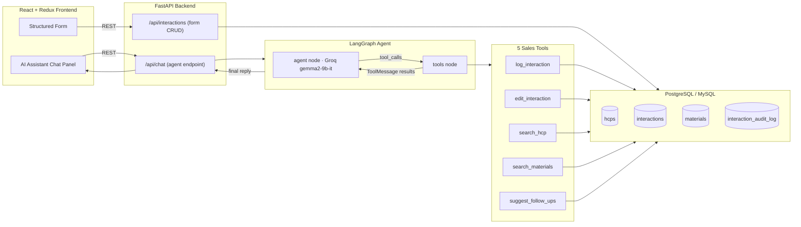

# AI-First CRM — HCP Module
## Log Interaction Screen — Project Analysis & Design Document

---

## 1. Objective

Field sales representatives need to capture every Healthcare Professional (HCP)
interaction — a meeting, call, email, or conference touchpoint — quickly,
accurately, and in whatever format is fastest in the moment: a structured
form when they have two minutes at their desk, or a natural conversation with
an AI assistant when they're walking out of a hospital and just want to talk
through what happened.

This module delivers the **Log Interaction Screen**: a dual-mode capture
surface backed by a **LangGraph agent** running on **Groq's `gemma2-9b-it`**
model, with `llama-3.3-70b-versatile` used as a larger-context pass for
entity extraction from long transcripts. The agent doesn't just chat — it
calls real tools that read and write the CRM database, so a rep can say
*"Met Dr. Sharma, discussed CardioPlus efficacy, shared the brochure,
she seemed positive"* and have a fully structured, auditable record appear
on the left-hand form in seconds.

---

## 2. Tech Stack (as mandated)

| Layer            | Choice                                   | Why |
|-------------------|-------------------------------------------|-----|
| Frontend           | **React 18 + Redux Toolkit**              | Predictable state for a form that's edited from *two* sources (manual typing and agent tool calls) — Redux gives a single source of truth. |
| Backend            | **Python + FastAPI**                      | Async-first, native Pydantic validation, first-class fit with LangGraph's Python SDK. |
| AI Agent Framework | **LangGraph**                             | Explicit state graph (not a black-box chain) — required to route between free chat and structured tool execution, with the full turn history auditable. |
| LLM                | **Groq — `gemma2-9b-it`** (primary) · `llama-3.3-70b-versatile` (context/extraction) | Groq's inference speed keeps the chat interface feeling instant on a rep's phone; the larger model is reserved for the heavier entity-extraction pass so cost stays low on the hot path. |
| Database           | **PostgreSQL / MySQL** (schema is dialect-portable) | Relational integrity between HCPs ↔ Interactions ↔ Materials ↔ Audit Log. |
| Font               | **Google Inter**                          | Loaded via Google Fonts, used across every weight in the UI. |

---

## 3. System Architecture



**Two logging paths converge on the same data model:**
1. **Structured form** → direct REST call → `interactions` table.
2. **Conversational chat** → LangGraph agent → tool call(s) → same
   `interactions` table, plus an `interaction_audit_log` row recording which
   tool made the change and why (full diff).

Because both paths write to the same schema, an interaction started in chat
can be *finished* on the form, and vice versa — the rep is never locked into
one mode.

---

## 4. The LangGraph Agent — Role & Reasoning Loop

The agent lives at `backend/app/agent/graph.py`. It's a two-node cyclic
graph, not a single prompt-and-response call:

```
START → agent → [has tool_calls?] → tools → agent → ... → END
                 [no tool_calls]  → END
```

- **`agent` node** — Groq `gemma2-9b-it`, bound to all 5 tools via native
  function-calling. It holds the system prompt that defines its persona (an
  assistant embedded in the Log Interaction screen) and decides, per turn,
  whether to reply directly or invoke one or more tools.
- **`tools` node** — a LangGraph `ToolNode` that executes whichever tools the
  model requested, against the live database, and returns `ToolMessage`
  results back into the conversation state.
- The loop repeats until the model responds with plain text and no further
  tool calls — e.g. it might call `search_hcp` → `log_interaction` →
  `suggest_follow_ups` in one user turn before composing a single confirmation
  message like *"Logged your meeting with Dr. Sharma — sentiment: positive.
  I've suggested 3 follow-ups below."*

State (`AgentState`) tracks the full message history (`add_messages`
reducer), the active `interaction_id`, `hcp_id`, and a `tool_calls_made`
audit trail — so a multi-turn conversation ("actually, change that to
negative sentiment") stays grounded in the same record.

---

## 5. The 5 LangGraph Tools

| # | Tool | Purpose | LLM Usage |
|---|------|---------|-----------|
| 1 | **`log_interaction`** *(mandatory)* | Creates a new interaction record from free text or a voice-note transcript. | Sends raw notes to `llama-3.3-70b-versatile` for JSON entity extraction (topics, sentiment, outcomes, follow-ups, summary) before persisting. |
| 2 | **`edit_interaction`** *(mandatory)* | Modifies an already-logged interaction via natural language (e.g. "change sentiment to positive"). | LLM interprets the instruction into a partial JSON patch; every edit is diffed and written to `interaction_audit_log` — nothing is silently overwritten. |
| 3 | **`search_hcp`** | Resolves a doctor by name/specialty/hospital; powers autocomplete in both chat and form. | No LLM call — direct DB search, kept fast and deterministic. |
| 4 | **`search_materials`** | Finds brochures/samples mentioned in conversation and attaches them to the interaction. | No LLM call — direct DB search + join-table write. |
| 5 | **`suggest_follow_ups`** | Reads the logged topics/sentiment/outcomes and proposes 2–4 concrete next actions. | LLM call to `llama-3.3-70b-versatile`, returns a JSON array rendered in the "AI Suggested Follow-Ups" box on the form. |

**Why these 5:** the two mandatory tools (`log_interaction`,
`edit_interaction`) cover the core write path. `search_hcp` and
`search_materials` keep the agent grounded in real CRM records instead of
hallucinating IDs. `suggest_follow_ups` is the "AI-first" differentiator —
it turns a logged interaction into a proactive next-best-action, which is
the actual commercial value a life-science field team wants from this
screen.

---

## 6. Screen Walkthrough (matches the provided mockup)

**Left pane — Interaction Details (structured form):**
HCP Name (autocomplete) · Interaction Type · Date/Time · Attendees · Topics
Discussed (with a *"Summarize from Voice Note"* affordance) · Materials
Shared / Samples Distributed (search + chip tags) · Sentiment (3-way pill
selector) · Outcomes · Follow-up Actions · AI Suggested Follow-Ups · Log
Interaction / Save Draft.

**Right pane — AI Assistant (chat interface):**
A running conversation where the rep can describe the visit in plain
language. Tool calls the agent makes are surfaced inline (e.g. *"⚙ used:
log_interaction, suggest_follow_ups"*) so the rep can trust what just
happened to their data — this is the auditability the audit-log table
supports on the backend.

---

## 7. Data Model Summary

- **`hcps`** — doctor directory (name, specialty, hospital, engagement tier).
- **`materials`** — brochures, leaflets, studies, and samples catalog.
- **`interactions`** — the core log: type, date/time, topics, sentiment,
  outcomes, follow-ups, an `ai_summary` field, and `raw_source` /
  `raw_transcript` so the original rep input is never lost even after LLM
  structuring.
- **`interaction_materials`** — join table for what was shared per visit.
- **`interaction_audit_log`** — every create/edit/suggestion, tagged with
  which tool performed it and a JSON diff — critical for a regulated,
  pharma-compliance context where "who changed what" must be traceable.

Full DDL: `backend/sql/schema.sql` (Postgres-flavored, MySQL-compatible with
the noted `AUTO_INCREMENT` swap).

---

## 8. API Surface

| Method | Path | Purpose |
|--------|------|---------|
| `GET`  | `/api/hcps?q=` | Autocomplete search over HCPs |
| `GET`  | `/api/materials?q=` | Autocomplete search over materials/samples |
| `POST` | `/api/interactions` | Create interaction (structured-form path) |
| `PATCH`| `/api/interactions/{id}` | Edit interaction (structured-form path) |
| `GET`  | `/api/interactions/{id}` | Fetch a single interaction |
| `POST` | `/api/chat` | Conversational path — routes through the LangGraph agent, returns the assistant's reply + which tools fired |

---

## 9. What's Included vs. What's a Natural Next Step

**Included in this deliverable:** full LangGraph agent + 5 tools wired to
Groq, FastAPI backend, relational schema with audit trail, and a complete
React/Redux implementation of the Log Interaction screen matching the
provided mockup.

**Natural next steps for a production build:** authenticated rep sessions
(the schema already has a `rep_id` column ready for it), streaming token-by-
token chat responses, a real speech-to-text pipeline behind the "Summarize
from Voice Note" button, and role-based access control on the audit log for
compliance review.
